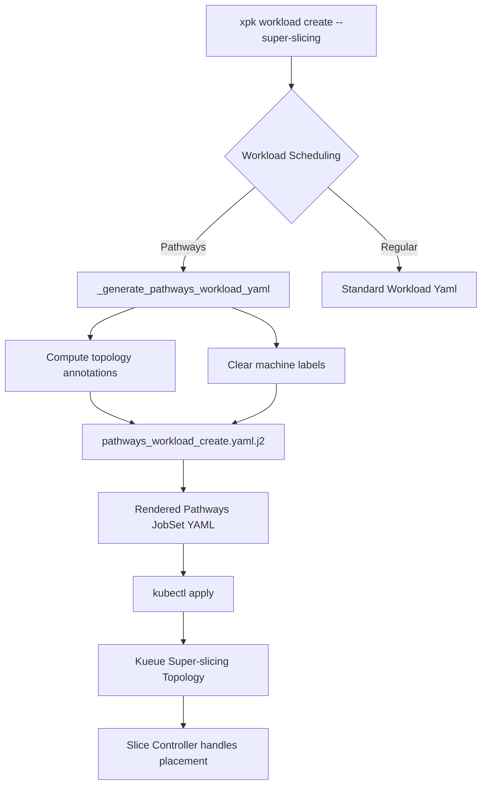

## Execution Plan
### 1. Analysis & Findings
- Key Files: 
  - `src/xpk/commands/workload.py`
  - `src/xpk/templates/pathways_workload_create.yaml.j2`
- Design Patterns: 
  - Super-slicing leverages the Kueue super-slicing topology and the slice controller. 
  - When super-slicing is enabled, workloads do not need a strict `node_selector_machine_label` as placement is handled by the slice controller via the `tpu_slice_topology_annotation`.
  - ReplicatedJobs (worker nodes) use standard JobSet definitions configured dynamically using Jinja templates.

### 2. System Architecture Diagram


### 3. Duckie Feedback Summary
- Advice: Ensure that JobSet annotations (such as one-to-one replica assignments) are properly evaluated for Pathways to avoid conflicts with Kueue's super-slicing placement logic. Verify whether JobSet-level annotations or worker-level annotations are more appropriate for Pathways.
- Action Taken: Added explicit steps to conditionally inject `jobset_annotations` into the Pathways Jinja template, mimicking the behavior used for regular TPU workloads to prevent placement conflicts.

### 4. Step-by-Step Implementation

1. **Refactor Annotation and Label Computation in `workload.py`**:
   - Locate the computation block for `machine_label`, `node_selector_machine_label`, `tpu_slice_topology_annotation`, and `jobset_annotations` inside the `workload_create` function (currently residing inside the `else:` block for standard workloads).
   - Move this entire block up, just *before* the workload type conditional (`if workload_system.accelerator_type == AcceleratorType.GPU:`).
   - Ensure the variables `use_sub_slicing` and `use_super_slicing` are defined before this block.
   - Adjust the `machine_label` computation to properly fall back or pass the `workload_system` even for Pathways workloads.

2. **Hoist Print Statements**:
   - Move the notification print statements for super/sub-slicing so they execute for all supported workloads (including Pathways):
     ```python
     if use_sub_slicing:
       xpk_print('Workload will be scheduled using the Sub-slicing feature.')
     if use_super_slicing:
       xpk_print('Workload will be scheduled using the Super-slicing feature.')
     ```
   - Ensure these are outside the non-Pathways `else:` block.

3. **Update `_generate_pathways_workload_yaml` Signature**:
   - Modify the signature of `_generate_pathways_workload_yaml` in `workload.py` to accept three new arguments:
     - `node_selector_machine_label: str`
     - `tpu_slice_topology_annotation: str`
     - `jobset_annotations: str`

4. **Update Template Rendering Call**:
   - Update the call to `_generate_pathways_workload_yaml` in `workload_create` to pass the newly computed variables:
     ```python
     yml_string = _generate_pathways_workload_yaml(
         args=args,
         workload_system=workload_system,
         parallel_containers=parallel_containers,
         placement_policy_label=placement_policy_label,
         autoprovisioning_args=autoprovisioning_args,
         node_selector_machine_label=node_selector_machine_label,
         tpu_slice_topology_annotation=tpu_slice_topology_annotation,
         jobset_annotations=jobset_annotations,
     )
     ```
   - Inside `_generate_pathways_workload_yaml`, update the `.render()` arguments to pass these variables to the Jinja template, removing the hardcoded `node_selector_machine_label=create_machine_label(workload_system)`.

5. **Modify `pathways_workload_create.yaml.j2` Template**:
   - Open `src/xpk/templates/pathways_workload_create.yaml.j2`.
   - **JobSet Annotations**: Add the `annotations` block under the top-level `metadata` if `jobset_annotations` exists:
     ```yaml
     metadata:
       name: {{ args.workload }}
       labels:
         ...
     
       annotations:
         {{ jobset_annotations }}
     
     ```
   - **Worker Annotations**: Locate `replicatedJobs` -> `worker` -> `template` -> `metadata` -> `annotations` and append the topology annotation conditionally:
     ```yaml
           metadata:
             labels:
               ...
             annotations:
               alpha.jobset.sigs.k8s.io/exclusive-topology: cloud.google.com/gke-nodepool
     
               {{ tpu_slice_topology_annotation }}
     
     ```

### 5. Verification & Validation
- Test Targets: 
  - Unit tests: Run `python3 -m unittest discover` to ensure template rendering logic remains intact.
  - Integration: End-to-end verification via cluster creation (`xpk cluster create-pathways --super-slicing`) and workload submission to ensure the slice controller successfully schedules the replica jobs.
- Rollout Strategy: 
  - Local verification via dry-run (`xpk workload create ... --use-pathways --dry-run`) to inspect generated YAML.
  - Verify Kueue topologies and JobSet placements via `kubectl get jobsets` and `kubectl describe localqueues`.
